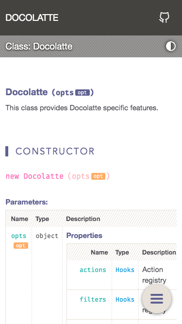
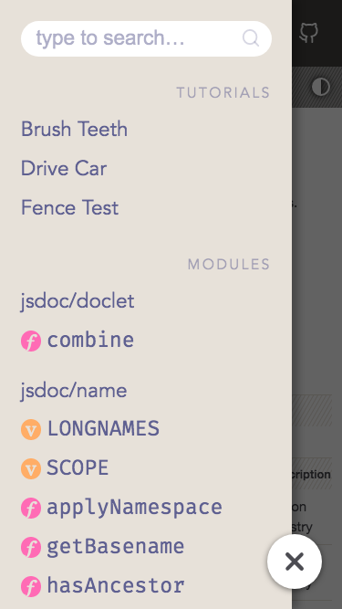

# Docolatte
:chocolate_bar: Bittersweet theme for JSDoc 3

[](https://www.npmjs.com/package/docolatte)

<!-- TOC depthfrom:2 -->

- [Docolatte v4 is out! :tada:](#docolatte-v4-is-out-tada)
    - [New Features](#new-features)
    - [Fixes](#fixes)
- [Notes for users](#notes-for-users)
- [Screenshots](#screenshots)
    - [Light Theme](#light-theme)
    - [Dark Theme](#dark-theme)
    - [Source](#source)
    - [Mobile](#mobile)
- [Features](#features)
    - [Keyboard-only Search & Navigation](#keyboard-only-search--navigation)
    - [Interactive TOC Table of Contents](#interactive-toc-table-of-contents)
- [Install](#install)
- [Usage](#usage)
- [Customize](#customize)
    - [Available Options](#available-options)
- [Custom Assets](#custom-assets)
    - [More complex options](#more-complex-options)
        - [Loading remote CSS & JS](#loading-remote-css--js)
        - [Importing Node modules](#importing-node-modules)
        - [Private import](#private-import)
        - [Ordering imports](#ordering-imports)
- [License](#license)

<!-- /TOC -->

## Docolatte v4 is out! :tada:

### New Features
- Finally, **dark theme** is implemented!
- All the colors and fonts are now **CSS variables**, which means you can customize the overall look & feel of Docolatte just by overwriting the variables in your custom CSS. On top of that, you can customize light theme and dark theme separately.
- A lot of design improvements
- Added icons to variables and functions in TOC
- Added "Scroll to Top" button
- URL hash is now synced with the current heading as the page scrolls
- Several new options (See below for details)

### Fixes
- Eliminated the possibilities of broken links shown in search results.
- Now SVG icons are properly shown without any warning for a local site (browsed with `file://` protocol).

## Notes for users
What's new in the latest update?
> See: [CHANGELOG.md](https://github.com/amekusa/docolatte/blob/trunk/CHANGELOG.md)

What's coming out in the next update?
> See: [TODO.md](https://github.com/amekusa/docolatte/tree/trunk/TODO.md)

Is this compatible with JSDoc v4.x?
> Search-indexing is partially not working with jsdoc@4.0.0. I recommend sticking with jsdoc v3.


## Screenshots

### Light Theme


### Dark Theme


### Source


### Mobile
| Menu:Off | Menu:On  |
|:--------:|:--------:|
|  |  |

(The sample codes in the screenshots are derived from [docdash/fixtures](https://github.com/clenemt/docdash/tree/master/fixtures))

[All screenshots](https://github.com/amekusa/docolatte/tree/trunk/gallery)


## Features
- Switchable dark/light themes
  - Theme preference can be saved to the browser's local storage
  - Can be synced with the user's system preference
- Responsive design with a wide variety of screen widths supported
- Indexed search, which:
  - is very quick
  - works on the local, without a server
- Code highlighting with [highlight.js](https://highlightjs.org/)
- Customizability
  - You can customize:
    - Header text, URL, and icon in the header
    - Copyright & license text in the footer
    - Meta tags, language settings, etc.
  - All the highlight.js themes are supported
  - Custom CSS and JS are supported
  - All the colors and fonts are easily customizable thanks to CSS variables
- Lightweight, no bloat
  - Docolatte doesn't rely on any frameworks for its front-end codebase. They are just basic JS, CSS, and HTML, but coded with good care.

### Keyboard-only Search & Navigation
You can easily navigate the entire site without using a mouse but only a keyboard. You don't need to click on the search box to type in.

[](https://www.youtube.com/watch?v=-HefBq5ZA40)

### Interactive TOC (Table of Contents)
The TOC on the sidebar is always synced with the current section you are looking at.

[](https://www.youtube.com/watch?v=Ejo8vogt920)


## Install
```sh
npm i --save-dev docolatte
```


## Usage
Specify the path to docolatte ( normally: `node_modules/docolatte` ) as the JSDoc template with `-t` option of `jsdoc` command:

```sh
$ jsdoc entry-file.js -t node_modules/docolatte
```

Or set the path to `opts.template` in your JSDoc configuration file:

```jsonc
{
  "opts": {
    "template": "node_modules/docolatte",
  }
}
```


## Customize
You can customize docolatte by setting options in JSDoc configuration file like this example:

```jsonc
{
  "templates": {
    "docolatte": {
      "import": [
        "custom.css",
        "custom.js"
      ],
      "branding": {
        "title": "My Project",
        "link":  "https://example.com/project/",
        "icon":  "home",
        "font": {
          "size":   "1.5em",
          "family": "Helvetica, sans-serif"
        }
      },
      "code": {
        "theme": "nord"
      },
      "meta": {
        "title":       "My Project",
        "description": "Welcome to my project.",
        "keywords":    "awesome, cool",
      },
      "footer": {
        "copyright": "&copy; 2023 John Programmer",
        "license":   "Licensed under the Apache License 2.0"
      }
    }
  }
}
```

You can see **the full list of available options here: [lib/defaults.json](lib/defaults.json)**. Copy this file and edit it as you like.

### Available Options
The following list is written in YAML format for the sake of readability.
You need to write the actual config in JSON format just like the above example.

```yml
# Docolatte specific options
templates.docolatte:
  import: Custom asset files to import (Explained later)
  minify: Whether to use minified JS and CSS [default:true]

  # Settings for the header on the top left
  branding:
    title: Title text
    link:  Link URL of the title
    icon:  Icon on the left [default:"home"]
           # See https://feathericons.com/

    # Font settings for the title
    font:
      size:   Font size
      family: Font family

  # Settings for code blocks
  code:
    theme: highlight.js theme [default:'base16/espresso']
           # See https://highlightjs.org/static/demo/

    # Settings for `@example` blocks
    examples:
      captionPrefix: Prefixes to mark a line as a caption
        # Default values:
        - '// '
        - '- '
        - '# '
        # Example:
        #   `@example // This text is parsed as a caption`

  # Settings for light/dark themes
  lightSwitch:
    hide: Whether to hide the switching button [default:false]
    default: Default theme [default:'auto']
             # NOTE: 'auto' theme tries to sync with
             #       user's system preference
    icons: Icons of the button for each theme

  # Settings for search
  search:
    limit: Max number of items shown in a dropdown menu [default:8]
    placeholder: Placeholder text for the search box

    hint:
      hide: Whether to hide the hint [default:false]
      body: Hint text

    keys: Keys of a doclet to match for search queries
          # See https://www.fusejs.io/api/options.html#keys

  # Settings for TOC
  toc:
    icons:
      variables: Whether to hide icons for variables
      functions: Whether to hide icons for functions

    # List of menu sections in order
    menus: {
      # Key   = Section key
      # Value = Heading text of the section
      #
      # Available section keys:
      #   tutorials
      #   modules
      #   externals
      #   namespaces
      #   classes
      #   interfaces
      #   events
      #   mixins
      #   globals
    }

  # Settings for the home page (index.html)
  home:
    package:
      hide: Whether to hide the package.json info [default:false]

  # Settings for README & tutorials
  readme:
    truncate: Whether to enable the truncation tags [default:true]
      # This removes the content between
      # <!--TRUNCATE:START--> and <!--TRUNCATE:END-->

    emoji:
      replace: Type(s) of emoji to be replaced [default:'colons']
        # Available types:
        - 'colons'
        - 'unified'
        - 'emoticons'
        - 'emoticons_with_colons'

      options: # Options for js-emoji
        replace_mode: [default:'unified'],
        allow_native: [default:true]
        # See https://github.com/iamcal/js-emoji

  # Settings for meta tags
  meta:
    lang:        `lang` attribute of <html> [default:'en']
    title:       Content of <title> element [defaults to `branding.title`]
    description: `content` attribute of <meta name="description">
    keywords:    `content` attribute of <meta name="keywords">
    author:      `content` attribute of <meta name="author">
    favicon:     Favicon image URL(s). Use array for multiple entries

  # Settings for the footer
  footer:
    copyright: Copyright text
    license:   License text
    hide:      Whether to hide the footer

  # Settings for data manipulation
  data:
    exlude: Doclet items to exclude (longname)
    removeOrphans: Whether to remove orphaned doclet items [default:true]

# All the options for the JSDoc's default theme
# are also compatible with Docolatte.
templates.default: { ... }
# See https://jsdoc.app/about-configuring-default-template.html
```

## Custom Assets
With the **`import`** option, you can use your own assets like CSS, JavaScript images, etc. for your documentation site.

```jsonc
// Example
"import": [
  "my-scripts/alfa.js",
  "my-styles/bravo.css",
  "my-fonts/charlie.woff"
]
```

This config results in copying the files to subdirectories under the JSDoc output directory.
The subdirectory name is determined by the file extension.

| File Ext. | Output Directory |
|----------:|:-----------------|
| `.js`     | `scripts/`       |
| `.css`    | `styles/`        |
| others    | `assets/`        |

Then, Docolatte writes the proper `<script>` and `<link>` tags linking to the imported scripts and styles in HTML like this:

```html
<head>
  ...
  <script src="scripts/alfa.js"></script>
  <link rel="stylesheet" href="styles/bravo.css">
  ...
</head>
```

### More complex options
Instead of just a file path, you can use an **object** to specify more complex rules for each file to import.

```jsonc
"import": [
  { "src": "my-scripts/alfa.js",  "dst": "foo/bar" },
  { "src": "my-scripts/bravo.js", "dst": "foo/bar", "as": "delta.js" }
]
```

- **`dst`** property specifies the destination directory of import.
- **`as`** property specifies a new filename for the imported file.

#### Loading remote CSS & JS
With the **`resolve`** property, you can specify how Docolatte looks up the `src`.
If you set `resolve` to `false`, Docolatte won't attempt to copy the file. Instead, only write `<script>` (or `<link>` for `*.css`) tag pointing at the `src` in HTML.

```jsonc
"import": [
  { "resolve": false, "src": "https://example.com/hello.js" }
]
```

#### Importing Node modules
By setting the `resolve` property to `'module'`, you can import files from Node modules in the dependencies of your current project.

```jsonc
"import": [
  { "resolve": "module", "src": "p5/lib/p5.js" }
]
```

#### Private import
If you set the **`private`** property to `true`, Docolatte will copy the file to the JSDoc output directory normally, but won't write `<script>` or `<link>` tags in HTML.

This is useful if you want to `@import` a CSS file from other CSS.

```jsonc
"import": [
  { "src": "my_styles/style.css" },
  { "src": "my_styles/variables.css", "private": true }
]
```
```css
/* style.css */
@import "variables.css";
```

#### Ordering imports
The order of `<script>` and `<link>` tags for imports is determined by the **`order`** property of each import.
The default value of `order` is `0`. The greater the value, the lower the tag is placed.
A negative value makes the tag placed earlier than the default scripts & styles of Docolatte.

```jsonc
"import": [
  { "order": 5, "src": "second.css" },
  { "order": 5, "src": "third.css" },
  { "order": 2, "src": "first.css" }
]
```
```html
<head>
  ...
  <link rel="stylesheet" href="styles/first.css">
  <link rel="stylesheet" href="styles/second.css">
  <link rel="stylesheet" href="styles/third.css">
  ...
</head>
```


## License
Docolatte is licensed under the [Apache License 2.0](https://github.com/amekusa/docolatte/blob/trunk/LICENSE.md).
